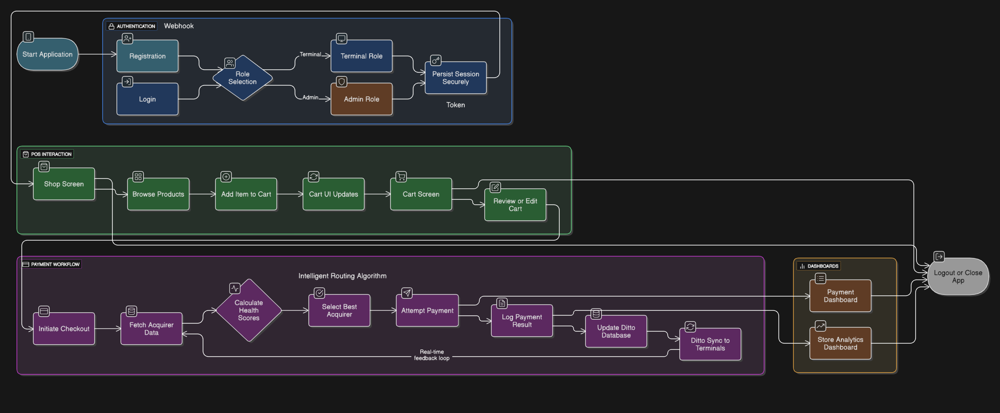

## Project Overview

### Application Entry Points

**DittoPosApp.kt** serves as the main application class annotated with `@HiltAndroidApp` to initialize the Hilt dependency injection framework.

**MainActivity.kt** acts as the primary UI entry point that sets up app theme, navigation, and handles runtime permissions required for Ditto.

### Dependency Injection (DI)

Hilt modules provide dependencies throughout the application:

**di/AppModule.kt** provides application-wide singletons like `DittoManager`, `DittoStoreManager`, and `EncryptedSharedPreferences`.

**di/AuthModule.kt** provides Retrofit and Moshi instances configured for the authentication service.

**di/PaymentModule.kt** provides a separate Retrofit instance configured for the payment service.

### User Interface (UI)

The UI is built entirely with Jetpack Compose and organized by feature.

#### Screens

**ui/view/AuthScreen.kt** handles the login and registration screen functionality.

**ui/view/ShopScreen.kt** displays the product catalog and allows users to add items to the cart.

**ui/view/CartScreen.kt** shows the shopping cart, allowing users to adjust quantities, remove items, and proceed to payment.

**ui/view/PaymentScreen.kt** manages the payment processing flow, displaying current state (processing, success, failed).

**ui/view/AnalyticsScreen.kt** provides a dashboard for store performance metrics like total revenue, transactions, and payment gateway rankings.

**ui/view/PaymentDashboardScreen.kt** offers a detailed log of all payment transactions.

**ui/view/PresenceViewer.kt** displays the Ditto Presence Viewer, a real-time graph of connected peers on the network.

#### Reusable Components

**components/composables.kt** contains common UI elements like `PrimaryActionButton` and `QuantityControlButton`.

**components/TerminalId.kt** displays the terminal ID with a tooltip for connection status.

**components/ConnectionStatusIndicator.kt** provides a simple icon indicating network connectivity.

### ViewModels

ViewModels manage UI-related data in a lifecycle-conscious way:

**ui/view/AuthViewModel.kt** handles authentication logic by interacting with the AuthRepository.

**ui/view/ShopViewModel.kt** manages the state for the ShopScreen, including the product catalog and shopping cart.

**ui/view/PaymentViewModel.kt** manages the payment processing logic and state.

**ui/view/AnalyticsViewModel.kt** fetches and provides data for the AnalyticsScreen.

**ui/view/ShopTopBarViewModel.kt** provides data for the top app bar in the ShopScreen.

### Theming

**ui/theme/Color.kt** defines the application's color palette.

**ui/theme/Theme.kt** configures the overall app theme, including color schemes for light/dark modes and typography.

